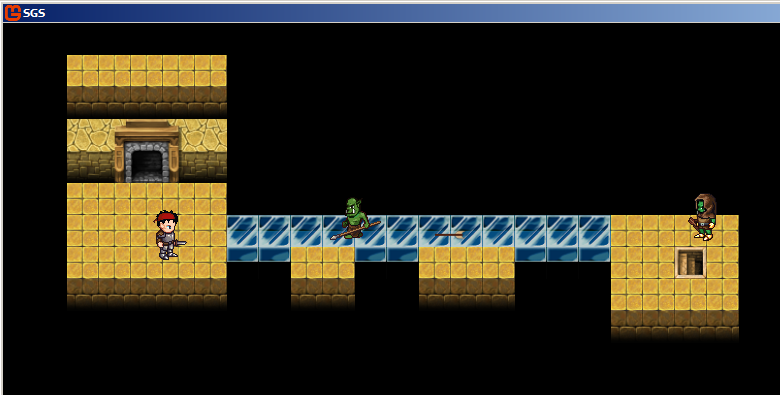
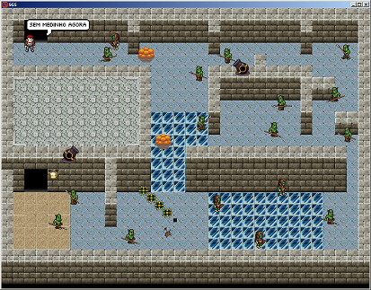

# game-sgs_lab

Laboratório de desenvolvimento de jogos utilizando Monogame e Monogame.Extended para criação de um jogo completo, com tela de apresentação, duas fases e tela de créditos finais. Entre os recursos de destaque estão a utilização de mapas de tile (Utilizando Tiled Map Editor) e shaders.

## Instalação

O projeto utiliza o monogame e monogame.extended (bibliotecas do monogame.extended podem ser encontradas na pasta `libs`). Por isso, instale o monogame antes de executar o projeto. 

## Preview

Fase 1  
  

Fase 2  

